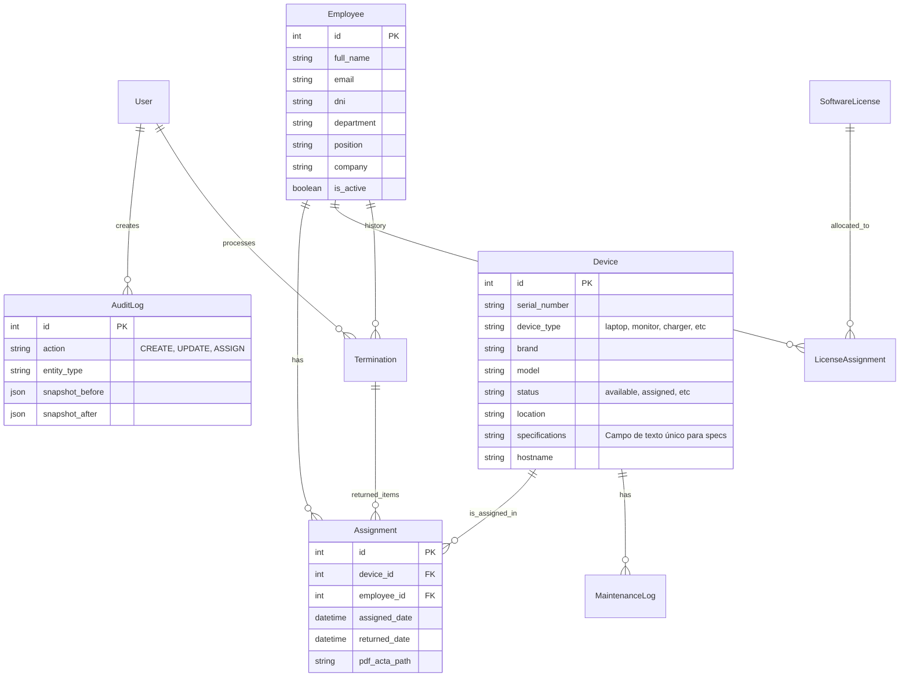

# Diagrama de Entidad-Relación (ER) - IT Inventory

```mermaid
erDiagram
    User ||--o{ AuditLog : "creates"
    User ||--o{ Termination : "processes"
    
    Employee ||--o{ Assignment : "has"
    Employee ||--o{ LicenseAssignment : "has"
    Employee ||--o{ Termination : "history"
    
    Device ||--o{ Assignment : "is_assigned_in"
    Device ||--o{ MaintenanceLog : "has"
    
    SoftwareLicense ||--o{ LicenseAssignment : "allocated_to"
    
    Termination ||--o{ Assignment : "returned_items"

    %% TABLAS PRINCIPALES
    
    Device {
        int id PK
        string serial_number
        string device_type "laptop, monitor, charger, etc"
        string brand
        string model
        string status "available, assigned, etc"
        string location
        string specifications "Campo de texto único para specs"
        string hostname
    }

    Employee {
        int id PK
        string full_name
        string email
        string dni
        string department
        string position
        string company
        boolean is_active
    }

    Assignment {
        int id PK
        int device_id FK
        int employee_id FK
        datetime assigned_date
        datetime returned_date
        string pdf_acta_path
    }

    AuditLog {
        int id PK
        string action "CREATE, UPDATE, ASSIGN"
        string entity_type
        json snapshot_before
        json snapshot_after
    }
```
